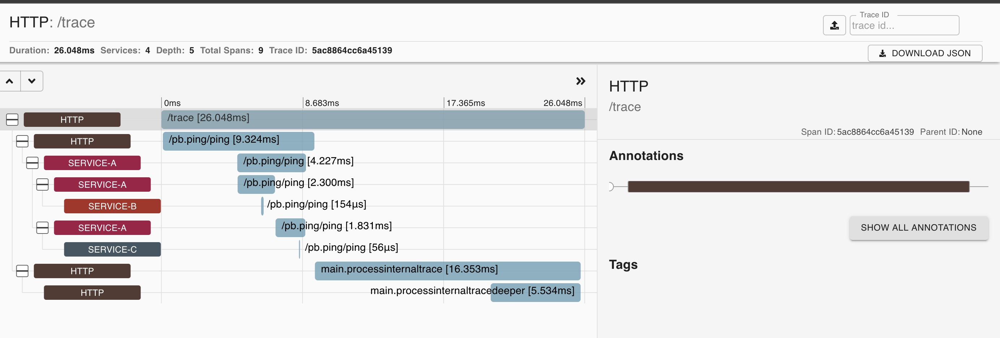

# opentracing-practice
opentracing practice in golang micro server (gRPC + HTTP)


## Practice Project Arch
```sh
                                +-- process internal trace2
                                |
                     +---> process internal trace1
                     |
                     |                 +---> server-b trace(gRPC)
entry(HTTP) ---> server-a trace--gRPC--|
                                       +---> server-c trace(gRPC)
                                                   |
                                                   +----> process internal trace3 (todo)
```

## Result Shots



## References

* https://zhuanlan.zhihu.com/p/79419529
* https://opentracing.io/docs/getting-started/