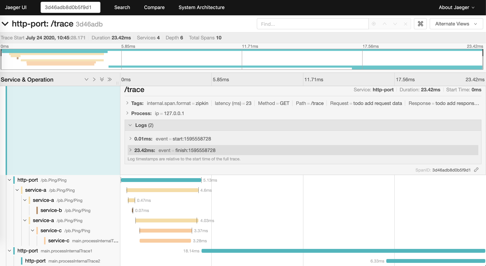
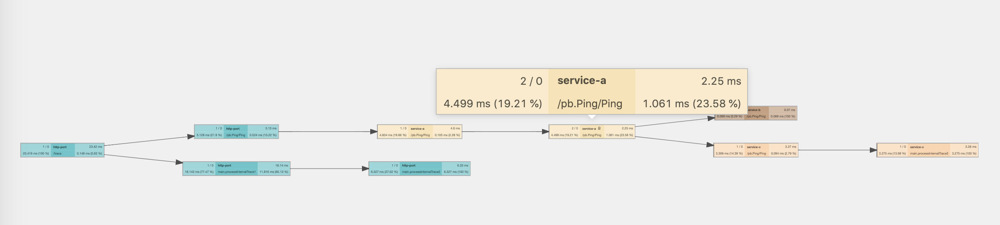
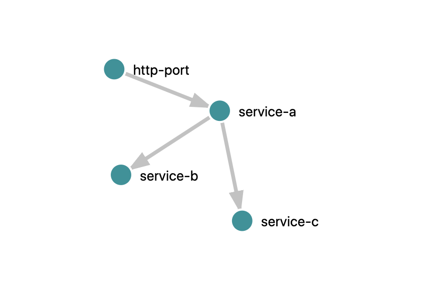

### Get started with jaeger.

1.Install `jaeger` `All in one`. You can then navigate to [http://localhost:16686](http://localhost:16686) to access the Jaeger UI.

```shell script
docker run -d --name jaeger \
  -e COLLECTOR_ZIPKIN_HTTP_PORT=9411 \
  -p 5775:5775/udp \
  -p 6831:6831/udp \
  -p 6832:6832/udp \
  -p 5778:5778 \
  -p 16686:16686 \
  -p 14268:14268 \
  -p 14250:14250 \
  -p 9411:9411 \
  jaegertracing/all-in-one:1.18
```

2.Ensure using jaeger tracer.

```go
import (
    xjaeger "github.com/yeqown/tracing-practice/x/opentracing/x-jaeger"
)

// path/to/opentraing-practice/x/boot.go
func BootTracerWrapper(localServiceName string, hostPort string) error {
    // replace here xjaeger.BootJaegerTracer
    tracer, err := xzipkin.BootZipkinTracer(localServiceName, hostPort) 
    //tracer, err := xjaeger.BootJaegerTracer(localServiceName, hostPort)
    // ...
}

// path/to/opentraing-practice/examples/http/middleware.go
func getTraceIdFromSpanContext(spCtx opentracing.SpanContext) string {
	return xzipkin.GetTraceIdFromSpanContext(spCtx)
	// return xjaeger.GetTraceIdFromSpanContext(spCtx)
}

```

3.Start servers

```sh
cd path/to/opentracing-practice

# c
go run examples/c/main.go

# b
go run examples/b/main.go

# a
go run examples/b/main.go

# http-server
go run examples/http/main.go
```

OR 

```
cd path/to/opentracing-practice

make run
```

3.Client do request.

```shell script
curl http://127.0.0.1:8080/trace
```

OR.
visit [http://127.0.0.1:8080/trace](http://127.0.0.1:8080/trace) in your browser.

4.Get traceId.

    from `conosole log` or `client response header`

### Result shots

##### trace timeline


##### trace chain(cross server and process internal)


##### system architecture



## Extension 

* [jaeger k8s deploy](https://github.com/jaegertracing/jaeger-kubernetes)
* [jaeger metrics with grafana](./jaeger-grafana.md)