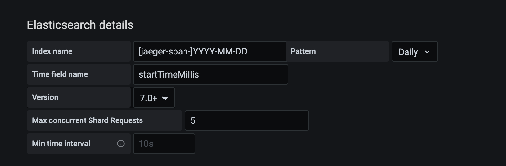

## Practice Jaeger metrics with Grafana

This part is not about Monitoring Jaeger itself but your services. It depends on **Jaeger Trace Data** including `Span` and `Service` in `Persistent storage`, here it is `ElasticSearch`. For example, in ElasticSearch you can get all index data by `curl -X GET http://127.0.0.1:9200/_cat/indices?v` then you'll get:

```sh
health status index                     uuid                   pri rep docs.count docs.deleted store.size pri.store.size
green  open   jaeger-span-2020-08-26    womVcjqSR-WGuISDsZyI7A   5   1    4847168            0    604.6mb        302.3mb
green  open   jaeger-span-2020-08-27    QWuZGdf6R0y8F2Xy-S0OvA   5   1    4632384            0    619.4mb        309.7mb
green  open   jaeger-span-2020-08-28    pWy26kXWTDyAjK9Io0UezQ   5   1    9273862            0        1gb          550mb
green  open   jaeger-span-2020-08-29    lKuEV7CAQyWLMkX1H92lNA   5   1    5063631            0    731.1mb        365.6mb
green  open   jaeger-span-2020-08-23    vxMoeUPYTrqHOOBAYfl8lA   5   1     683045            0     59.1mb         29.5mb
green  open   jaeger-span-2020-09-01    KCrizf04QSGR_Rhrxiw7rw   5   1    4819825            0    599.2mb        299.6mb
green  open   jaeger-span-2020-08-24    XXIrzr6rRtuz1lBm6mXr-A   5   1    3556900            0    428.4mb          214mb
green  open   jaeger-span-2020-08-25    7p4v2ConQru0HWmPcLvJQQ   5   1    4727645            0    544.1mb          272mb
green  open   jaeger-service-2020-08-31 Yivx6XxdQL2Yj7g8uCdvnA   5   1       1473           78      546kb        301.4kb
green  open   jaeger-service-2020-08-30 ccofJ6R4QWGiqVC2PbTMWA   5   1        462           23    411.8kb        204.1kb
green  open   jaeger-service-2020-09-01 ULmiJpCIT1-r-4EXHwwFEQ   5   1       1686            1    605.2kb        280.5kb
green  open   jaeger-service-2020-08-24 7merYCz6SxGOTwKQRKd8og   5   1        881           26    445.1kb        216.7kb
green  open   jaeger-service-2020-08-23 NV8PS-8GTqK9HRQfRC6g_g   5   1        193           14    331.6kb        165.8kb
green  open   jaeger-service-2020-08-26 gdg_sRlgTAOY7DjaSFL4lQ   5   1       1386           61    539.5kb          273kb
green  open   jaeger-service-2020-08-25 J39r0ZzIQP20Gy8cL7BE7g   5   1       1036           15    437.9kb        217.2kb
green  open   jaeger-service-2020-08-28 o0U4Y57cRgmIHUVruYj6PA   5   1       1695           84    653.8kb        351.7kb
green  open   jaeger-span-2020-08-30    f9k3C4ddTn2Pks6aOmBFWw   5   1    3312113            0    279.8mb        139.8mb
green  open   jaeger-service-2020-08-27 ChqLIimNQn26PR-13UJxfA   5   1       1080           45    482.8kb        259.8kb
green  open   jaeger-span-2020-08-31    K1oN9xDtRyKJ8HvGW16DcQ   5   1    6322490            0    726.4mb        363.2mb
green  open   jaeger-service-2020-08-29 fg43F3CSQXeHGMrFiSTzMQ   5   1        835           42    460.6kb        246.8kb
```

Then you can deal data to the form what you want. Here are some examples:

* service latency in p50, p90, p99, p99.9

### Grafana Config

##### Set up a DataSource

Hint: Make sure the `/$index/_mapping` contains `date` type field to be used by `Grafana.TimeFieldName` .



##### ES hints

REST API base

```sh
curl -X GET -H content-type:application/json http://127.0.0.1:9200/jaeger-span-2020-08-31/_search?size=0
```

> following JSON objects are request body

* process.serviceName latency distribution

```json
{
    "aggs": {
        "serviceTerm": {
            "terms": {
                "field": "process.serviceName"
            },
            "aggs": {
                "durationPercentile": {
                    "percentiles": {
                        "field": "duration",
                        "percents": [50, 95, 99, 99.9]
                    }
                }
            }
        }
    }
}
```

* 


### References

* https://www.cnblogs.com/leeSmall/p/9215909.html [Chinese blog post about ElasticSearch aggregations]
* https://grafana.com/docs/grafana/latest/features/datasources/elasticsearch/#using-elasticsearch-in-grafana [GrafanaLab document about using ElasticSearch as DataSource]